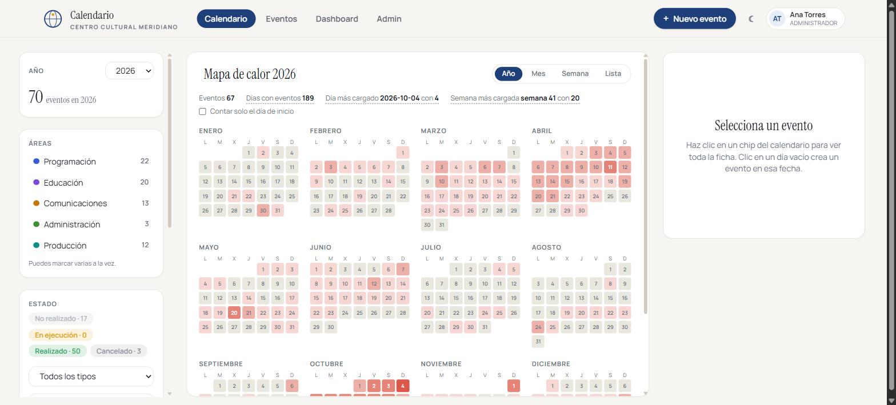

# Calendario Institucional

Calendario compartido para organizaciones con varias áreas. Cada área es dueña
de sus eventos y solo ella puede editarlos, todo cambio queda registrado, y la
carga de trabajo se lee de un vistazo en dos mapas de calor.

La demostración usa datos ficticios de un centro cultural inventado, el **Centro
Cultural Meridiano**.



## El problema que resuelve

Cuando cinco áreas de una misma institución programan actividades por su cuenta,
pasan tres cosas: nadie sabe qué está haciendo el resto, se pisan las fechas, y
al final del año no hay manera de saber quién hizo cuánto ni cuándo.

Esta aplicación pone las tres respuestas en una sola pantalla.

## Qué hace

- **Calendario compartido** en vistas de año, mes, semana y lista, con arrastrar
  y soltar para mover un evento de fecha.
- **Permisos por área.** Un administrador lo ve y edita todo. Cualquier otra
  persona solo puede tocar los eventos de su área, aunque vea los del resto.
- **Mapa de calor anual** que muestra qué días están cargados, con filtros
  combinables por área, estado, tipo y público.
- **Matriz de carga por área y mes** en el panel de indicadores, para detectar de
  un golpe si un área tiene el año amontonado en dos meses.
- **Historial de auditoría** con quién hizo qué, qué campo cambió y con qué valor.
- **Papelera con motivo obligatorio.** Borrar es una baja lógica: hay que explicar
  por qué, y un administrador puede restaurar el evento.
- **Catálogos que aprenden.** Si alguien escribe un valor nuevo queda disponible
  para el resto, con detección de duplicados por parecido para evitar que
  convivan "Teatro" y "teatro ".
- **Exportación a CSV** de lo que haya en pantalla con los filtros aplicados.

| Calendario mensual | Indicadores |
|---|---|
|  |  |

## Probarlo en un comando

```bash
git clone https://github.com/Michse017/calendario-institucional.git
cd calendario-institucional
docker compose up --build
```

Abre <http://localhost:8080>. La base se crea, se aplica el esquema y se siembran
los datos de ejemplo automáticamente al arrancar.

La pantalla de acceso lista tres cuentas y las rellena con un clic:

| Cuenta | Puede |
|---|---|
| `ana.torres@meridiano.demo` | Administradora: ve y edita todo |
| `carlos.mena@meridiano.demo` | Solo edita los eventos de Programación |
| `lucia.ferrer@meridiano.demo` | Solo edita los eventos de Comunicaciones |

Todas usan la contraseña `demo1234`. Entra con una de área y comprueba que el
botón de editar desaparece en los eventos que no le pertenecen.

Los datos se reinician solos cada madrugada, así que puedes crear, editar y
borrar sin miedo. Un administrador también puede devolverlos a su estado inicial
en el momento, desde el panel de administración.

## Cómo está construido

PHP 8.3 sin framework, con un enrutador y una autocarga PSR-4 propios. La idea
era sostener una aplicación real sin arrastrar dependencias, y que el código se
pueda leer de principio a fin.

| Capa | Qué hay |
|---|---|
| `app/Core` | Enrutador, petición, respuesta, sesión, autenticación, CSRF, validación, cabeceras de seguridad |
| `app/Models` | Acceso a datos con PDO y consultas preparadas |
| `app/Controllers` | Un controlador por área funcional |
| `app/Views` | Plantillas PHP planas, sin motor de plantillas |
| `public/assets` | Tailwind 4 compilado, Alpine.js para el comportamiento |
| `tests` | Batería propia, sin dependencias externas |

En el navegador: **Alpine.js** para el estado de la interfaz, **FullCalendar**
para la rejilla del calendario y **ECharts** para las gráficas.

### Decisiones que vale la pena comentar

**Una sola tabla de catálogos.** Tipos, públicos, áreas, ciudades y líneas viven
en `catalogo_valores` con una columna `campo`. Evita ocho tablas casi idénticas y
permite que la detección de duplicados y el recuento de usos se escriban una vez.

**El valor normalizado como clave.** Cada valor guarda su forma visible y otra en
minúsculas, sin tildes y con los espacios colapsados. Esa segunda es la que lleva
el índice único, así que "Teatro" y "teatro " no pueden coexistir.

**Eliminación lógica en todo.** Ni eventos ni usuarios se borran nunca: se marcan.
El historial necesita que la fila siga existiendo para poder decir quién hizo qué.

**El CSS propio vive en el fuente de Tailwind, no en el compilado.** Parece obvio,
pero `npm run build` regenera el archivo entero: cualquier regla escrita a mano en
el compilado desaparecería en la siguiente compilación. Hay un paso de integración
continua (`bin/verificar_css.mjs`) que recompila y compara el conjunto de clases
propias, así que si alguien escribe una regla en el sitio equivocado, salta.

**El reinicio de la demo no lanza procesos.** Llama a la clase sembradora
directamente en lugar de invocar PHP por consola, porque `exec()` está
desactivado en la mayoría de alojamientos compartidos y eso dejaría la demo sin
poder reiniciarse justo donde suele vivir.

## Seguridad

El detalle completo está en [`docs/SEGURIDAD.md`](docs/SEGURIDAD.md). En resumen:

| Riesgo | Cómo se ataja |
|---|---|
| Inyección SQL | Consultas preparadas sin excepción; los nombres de tabla nunca vienen de la petición |
| XSS | Todo lo que sale a la plantilla pasa por `h()`, y una política de contenido limita de dónde se carga el código |
| CSRF | Testigo por sesión exigido en toda petición que modifica algo, y cookie con `SameSite` |
| Contraseñas | `password_hash` con el algoritmo por defecto de PHP, y recifrado automático si el coste queda corto |
| Enumeración de usuarios | El acceso tarda lo mismo exista el correo o no, y el mensaje de error es idéntico en ambos casos |
| Fuerza bruta | Cinco intentos fallidos por correo en quince minutos, y un umbral más alto por dirección |
| Fijación de sesión | El identificador se regenera en el momento de autenticar |
| Robo de cookie | `HttpOnly`, `SameSite` y `Secure` fuera de desarrollo |
| Secretos filtrados | Nada de credenciales en el repositorio; solo `.env.example` con valores de ejemplo |

## Desarrollo

```bash
cp .env.example .env          # ajusta los datos de tu base
mysql -u root < sql/001_schema.sql
php bin/sembrar_demo.php --con-usuarios
php -S localhost:8000 -t public
```

Pruebas:

```bash
php tests/run.php             # toda la batería
php tests/run.php Usuario     # solo un archivo
```

Las que necesitan base de datos se omiten solas si no la encuentran, y cada una
corre dentro de una transacción que siempre se revierte, así que no ensucian nada.

Estilos:

```bash
npm install
npm run build                 # compila public/assets/css/app.css
npm run watch                 # recompila al guardar
```

## Licencia

[MIT](LICENSE).
