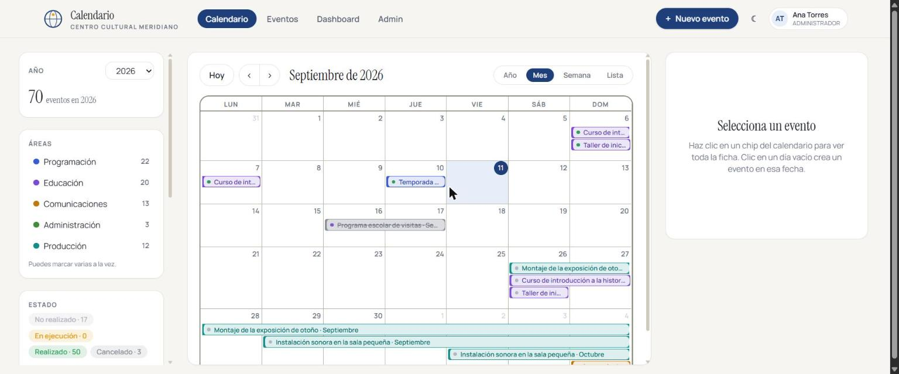
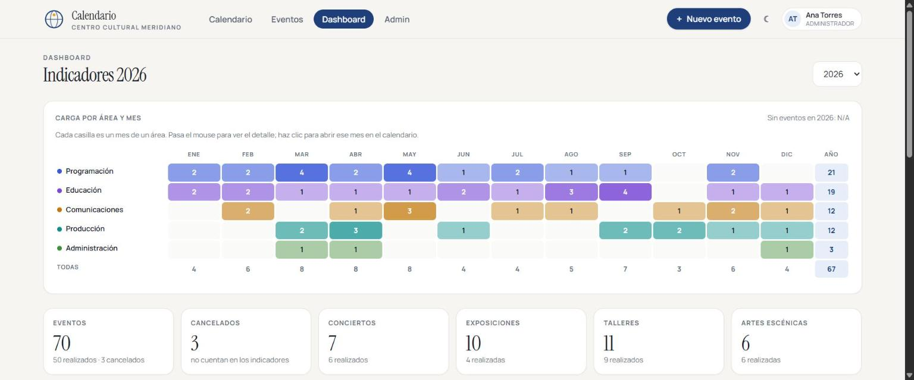

# Institutional Calendar

[](https://github.com/Michse017/calendario-institucional/actions/workflows/ci.yml)
[](LICENSE)
[](https://www.php.net/)

**[See the live demo](https://p01--calendario-app--4vlvttwlglcs.code.run/)**  ·  [Architecture and diagrams](docs/ARCHITECTURE.md)  ·  [Security](docs/SECURITY.md)  ·  [Deployment](docs/DEPLOYMENT.md)

Sign in with any of the three sample accounts listed on the login screen itself.
The data resets to its initial state every night.

A shared calendar for organisations with several departments. Each department
owns its events and is the only one that can edit them, every change is
recorded, and the workload can be read at a glance from two heat maps.

The demo uses fictional data from an invented arts venue, **Meridiano Cultural
Center**.


## The problem it solves

When five departments of the same institution schedule activities on their own,
three things happen: nobody knows what the others are doing, dates collide, and
by the end of the year there is no way to tell who did how much, or when.

This application puts all three answers on a single screen.

## What it does

- **Shared calendar** in year, month, week and list views, with drag and drop to
  move an event to another date.
- **Per-department permissions.** An administrator sees and edits everything.
  Anyone else can only touch the events of their own department, even though
  they can see the rest.
- **Annual heat map** showing which days are busy, with filters that combine by
  department, status, type and audience.
- **Workload matrix by department and month** on the dashboard, to spot at a
  glance whether a department has crammed its year into two months.
- **Audit trail** recording who did what, which field changed and to what value.
- **Recycle bin with a mandatory reason.** Deleting is a soft delete: you have
  to say why, and an administrator can restore the event.
- **Catalogues that learn.** If someone types a new value it becomes available
  to everyone else, with near-duplicate detection so that "Theatre" and
  "theatre " cannot coexist.
- **CSV export** of whatever is on screen, with the active filters applied.

| Month view | Dashboard |
|---|---|
|  |  |

## Try it in one command

```bash
git clone https://github.com/Michse017/calendario-institucional.git
cd calendario-institucional
docker compose up --build
```

Open <http://localhost:8080>. The database is created, the schema applied and
the sample data seeded automatically on start-up.

The login screen lists three accounts and fills them in with one click:

| Account | Can |
|---|---|
| `ana.torres@meridiano.demo` | Administrator: sees and edits everything |
| `carlos.mena@meridiano.demo` | Only edits Programming events |
| `lucia.ferrer@meridiano.demo` | Only edits Communications events |

All of them use the password `demo1234`. Sign in with a department account and
check that the edit button disappears on events that are not theirs.

The data resets itself every night, so you can create, edit and delete without
worrying. An administrator can also reset it on the spot from the admin panel.

## How it is built

PHP 8.3 with no framework, with a hand-written router and PSR-4 autoloader. The
idea was to hold up a real application without dragging in dependencies, and to
keep the code readable from beginning to end.

| Layer | What lives there |
|---|---|
| `app/Core` | Router, request, response, session, authentication, CSRF, validation, security headers |
| `app/Models` | Data access through PDO with prepared statements |
| `app/Controllers` | One controller per functional area |
| `app/Views` | Plain PHP templates, no template engine |
| `public/assets` | Compiled Tailwind 4, Alpine.js for behaviour |
| `tests` | A test runner of its own, with no external dependencies |

In the browser: **Alpine.js** for interface state, **FullCalendar** for the
calendar grid and **ECharts** for the charts.

> **A note on language.** The source code, the database schema and the user
> interface are written in Spanish, the language of the team that built it. The
> documentation is in English. Renaming identifiers purely for display would
> have meant a rewrite with no functional gain, so the choice was made
> deliberately rather than by omission.

### Decisions worth commenting on

**A single catalogue table.** Types, audiences, departments, cities and strategic
lines all live in `catalogo_valores` with a `campo` column. It avoids eight
nearly identical tables and lets duplicate detection and usage counting be
written once.

**The normalised value as the key.** Every value stores its display form and a
second one in lower case, without accents and with whitespace collapsed. That
second form carries the unique index, so "Theatre" and "theatre " cannot
coexist.

**Soft deletion everywhere.** Neither events nor users are ever deleted: they
are flagged. The audit trail needs the row to keep existing in order to say who
did what.

**Custom CSS lives in the Tailwind source, not in the compiled file.** It sounds
obvious, but `npm run build` regenerates the whole file: any rule hand-written
into the compiled output would vanish on the next build. A CI step
(`bin/verificar_css.mjs`) recompiles and compares the set of custom classes, so
if someone writes a rule in the wrong place, it trips.

**Resetting the demo spawns no processes.** It calls the seeder class directly
instead of invoking PHP through the shell, because `exec()` is disabled on most
shared hosting, and that would leave the demo unable to reset itself exactly
where it tends to live.

## Architecture

[`docs/ARCHITECTURE.md`](docs/ARCHITECTURE.md) collects eight diagrams: the
infrastructure, the continuous integration pipeline, the nightly reset, the
layers of the code, the path of a request, the sign-in flow, the data model and
the container start-up. They are written in Mermaid, so they are edited as text
and age alongside the code instead of drifting out of date in a stray image.

## Security

The full detail is in [`docs/SECURITY.md`](docs/SECURITY.md). In short:

| Risk | How it is handled |
|---|---|
| SQL injection | Prepared statements without exception; table names never come from the request |
| XSS | Everything reaching a template goes through `h()`, and a content policy limits where code may be loaded from |
| CSRF | A per-session token is required on every request that changes something, plus a `SameSite` cookie |
| Passwords | `password_hash` with PHP's default algorithm, and automatic rehashing if the cost falls behind |
| User enumeration | Signing in takes the same time whether the address exists or not, and the error message is identical either way |
| Brute force | Five failed attempts per address in fifteen minutes, and a higher threshold per IP |
| Session fixation | The identifier is regenerated at the moment of authentication |
| Cookie theft | `HttpOnly`, `SameSite` and `Secure` outside development |
| Leaked secrets | No credentials in the repository; only `.env.example` with placeholder values |
| Injected scripts | The policy does not allow `unsafe-inline`: the single inline script is authorised by a nonce that differs on every response |
| Compromised CDN | The five external resources carry a pinned version and a `sha384` digest; if the file does not match, the browser will not run it |

## Development

```bash
cp .env.example .env          # point it at your own database
mysql -u root < sql/001_schema.sql
php bin/sembrar_demo.php --con-usuarios
php -S localhost:8000 -t public
```

Tests:

```bash
php tests/run.php             # the whole suite
php tests/run.php Usuario     # a single file
```

The ones that need a database skip themselves if they cannot find one, and each
runs inside a transaction that is always rolled back, so they leave nothing
behind.

Styles:

```bash
npm install
npm run build                 # compiles public/assets/css/app.css
npm run watch                 # recompiles on save
```

## Deployment

The demo runs in a container built from this same image, against a managed
MySQL database. Environment variables, the nightly reset and the post-deploy
checks are in [`docs/DEPLOYMENT.md`](docs/DEPLOYMENT.md).

## License

[MIT](LICENSE).
