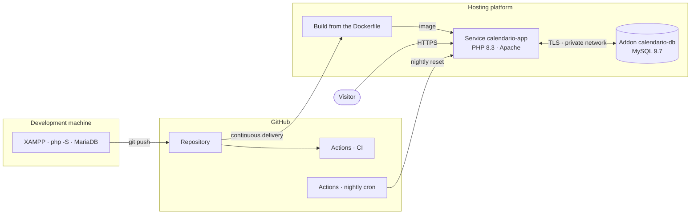
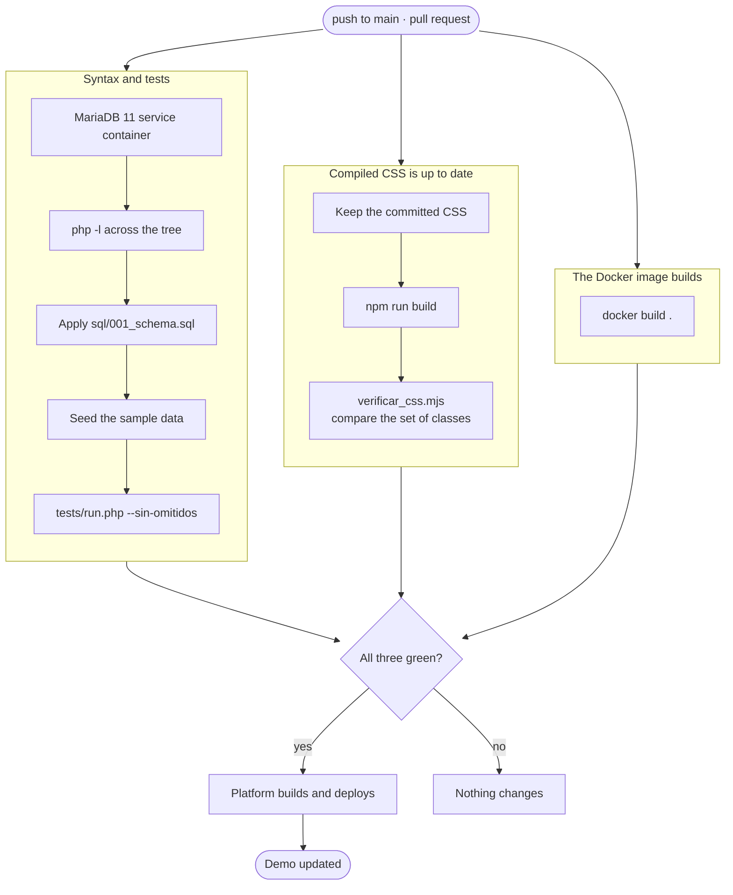
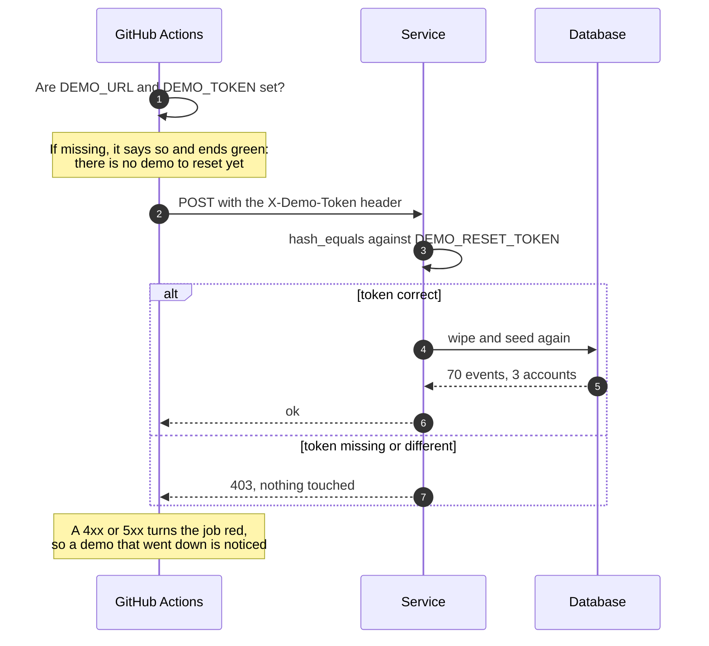
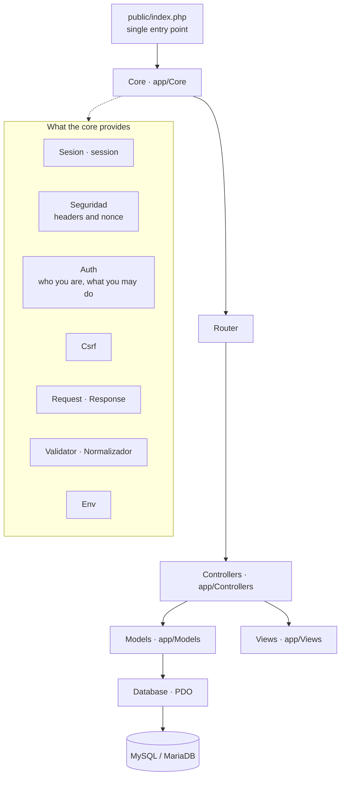
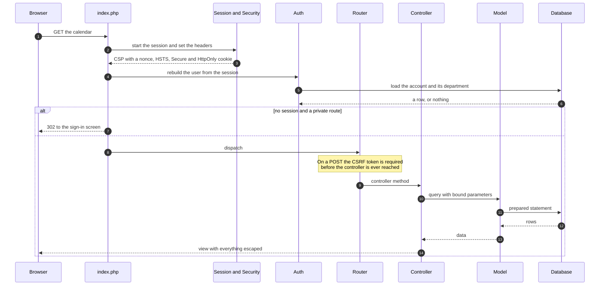
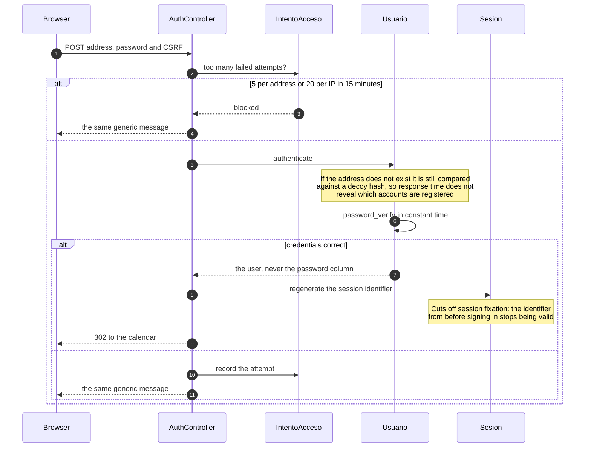
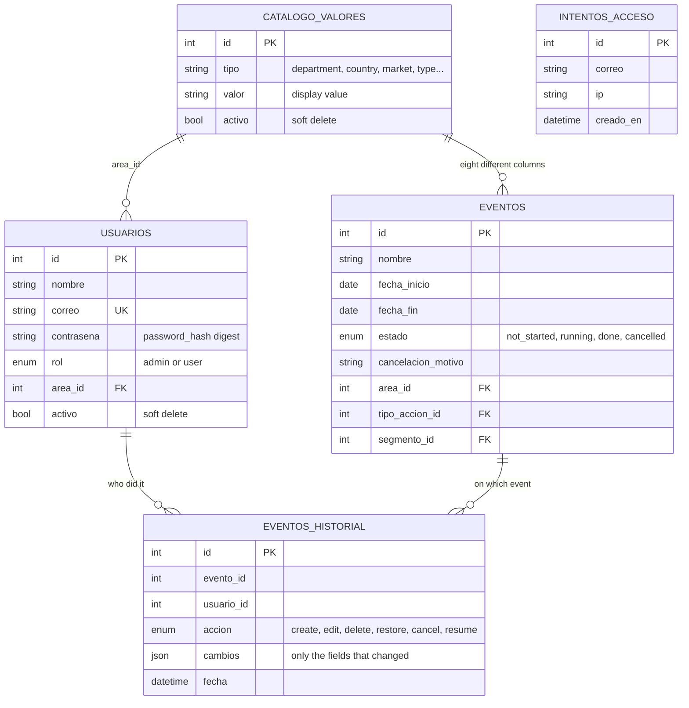
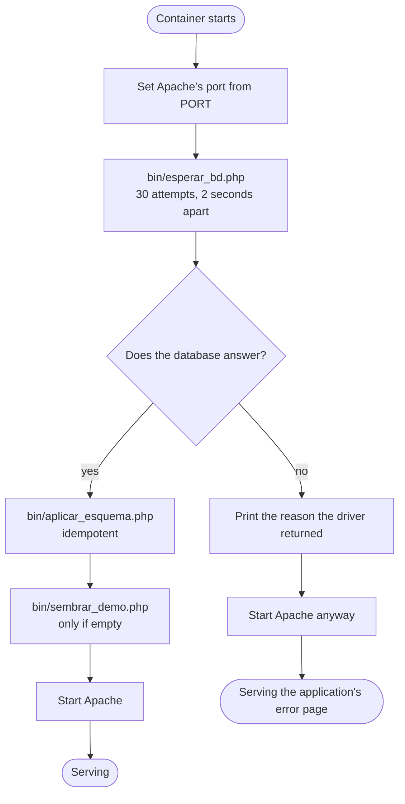

# Architecture

The diagrams are written in Mermaid, which GitHub draws on its own. They are
edited as text, so they age alongside the code instead of drifting out of date
in an image nobody ever exports again.

- [Infrastructure](#infrastructure)
- [Continuous integration and delivery](#continuous-integration-and-delivery)
- [Layers of the code](#layers-of-the-code)
- [The path of a request](#the-path-of-a-request)
- [How signing in works](#how-signing-in-works)
- [Data model](#data-model)
- [Container start-up](#container-start-up)

## Infrastructure

Three pieces: the repository, a service running the image, and a managed
database. Nothing else. The container keeps no state, so restarting it loses
nothing and it can be replaced while running.

Details the drawing does not show:

| | |
|---|---|
| The database speaks **only** over the private network | It has no public address. Only the service in the same project can reach it |
| The connection is **encrypted** | The server has `require_secure_transport=ON` and flatly rejects any connection in the clear |
| The platform decides the port | It arrives in the `PORT` variable and start-up reconfigures Apache with it |
| The container writes nothing that matters | All state lives in the database. There are no volumes |

## Continuous integration and delivery

Every push to `main` and every pull request fire three jobs in parallel. Only
when the repository is green does the platform build and publish.

### What each job guards, and why it exists

None of the three is decoration. Each one was born from a failure that actually
happened.

| Job | Guards | The real failure that justifies it |
|---|---|---|
| **Syntax and tests** | 71 tests against a real database | The suite passed green with 35 tests silently **skipped**, because without a database they skip themselves. `--sin-omitidos` turns skipping into failure |
| | Strict SQL mode | The development MariaDB is permissive and was turning a `NULL` into the default value. The error only surfaced on deploy. The connection now forces `STRICT_TRANS_TABLES` so it breaks on the developer's own machine |
| | Seeding happens **before** testing | Some tests check that the catalogues are complete. It also proves the seeder works against a clean database |
| **Compiled CSS is up to date** | That no custom class goes missing | `npm run build` regenerates the whole sheet. Any rule hand-written inside the compiled file would disappear on the next build, without warning |
| **The Docker image builds** | That the `Dockerfile` is still valid | A build failure otherwise only shows up at deploy time, which is the worst possible moment |

The CSS check **does not compare byte for byte**. Tailwind 4 scans the project
on its own on top of the declared `@source` entries, and the result depends on
the file system: Windows and the Linux runner produce different sheets. So what
is compared is the **set of custom classes**, which is what actually matters.
Tested in both directions: it catches the missing class and does not trip on a
harmless change.

### Nightly reset

The demo is public and anyone can create, edit and delete. Every night it
returns to its initial state on its own.

It is scheduled on GitHub rather than in the platform's own cron on purpose:
that way it works the same even if the demo changes provider.

### Secrets required

| Where | Name | What for |
|---|---|---|
| GitHub › Settings › Secrets › Actions | `DEMO_URL` | The demo's address, with no trailing slash |
| GitHub › Settings › Secrets › Actions | `DEMO_TOKEN` | The same value as `DEMO_RESET_TOKEN` in the environment |
| Platform › Environment variables | `DEMO_RESET_TOKEN` | Authorises the reset |
| Platform › Environment variables | `DB_SSL=true` | The managed database requires an encrypted connection |

## Layers of the code

PHP with no framework, with a PSR-4 autoloader of its own. The rule is that each
layer only knows the one below it.

Views do not query the database. Models do not write HTML. Controllers do not
build SQL. When that separation breaks it shows immediately: the model's test
stops being runnable without standing up half the application.

## The path of a request

## How signing in works

The error message is deliberately identical in all three cases. Saying "that
address does not exist" hands whoever is probing a list of valid accounts.

## Data model

Five tables. The decision that explains the whole thing is the first one: every
catalogue lives in **a single table**, told apart by its `tipo` column.

Why it looks like this:

- **A single catalogue.** Eight different lists (departments, countries,
  markets, types, audiences, strategic lines, cities, organisers) with the same
  shape: a value, an order and a soft delete. Eight identical tables would have
  meant eight models, eight admin screens and eight migrations every time
  anything changed.
- **Soft deletion everywhere.** Nothing is ever removed. A retired department
  has to keep existing so that old events can still name their department.
- **`eventos_historial` has no foreign key, on purpose.** The record of who did
  what must outlive the event itself. A foreign key with cascading delete would
  wipe out exactly the evidence worth keeping.
- **`cambios` is a JSON column.** It stores only the fields that changed. It is
  the reason MySQL 8 or MariaDB 10.5 upwards is required.

## Container start-up

Two decisions that took some finding:

**The wait uses the same `Database` class as the application.** When the
start-up check keeps its own copy of the connection logic, it lies as soon as
that logic changes. That is exactly what happened here: the database required
TLS, the check did not account for it, and the log only said "no answer".

**If the database never answers, Apache starts anyway.** A container that dies
in a loop only produces "connection refused", which tells nobody anything.
Alive, the application shows its own error page and the logs stay visible.
