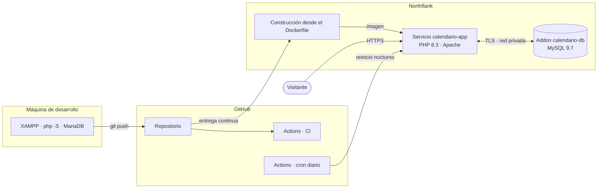
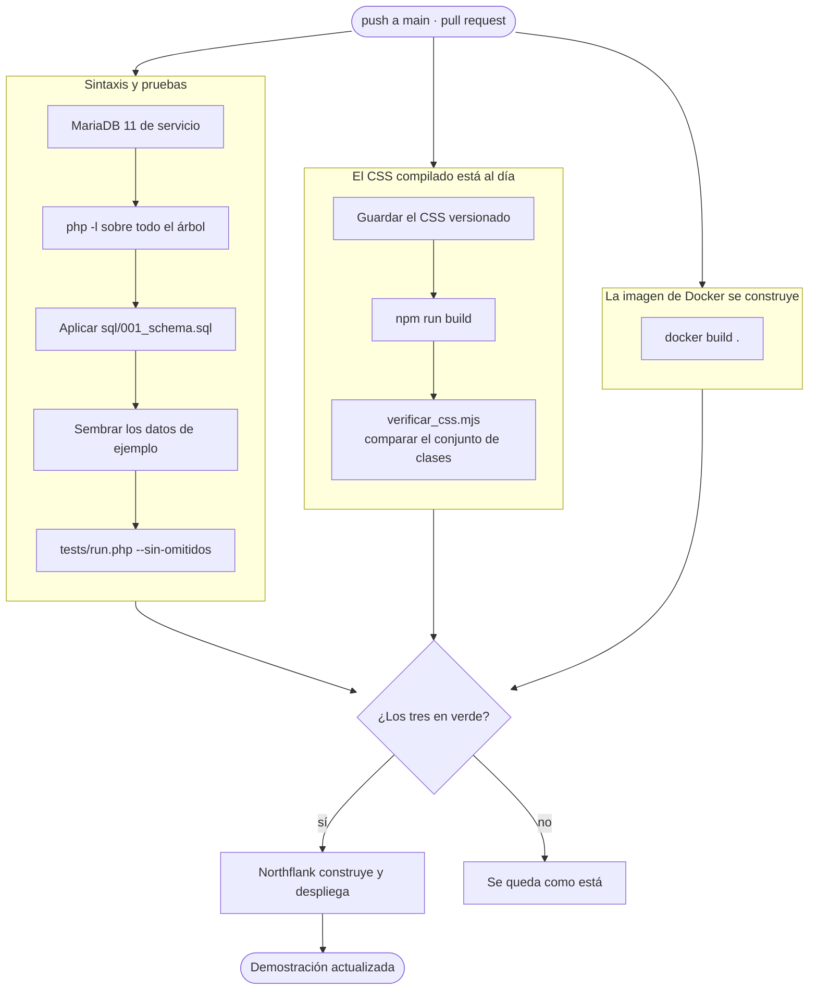
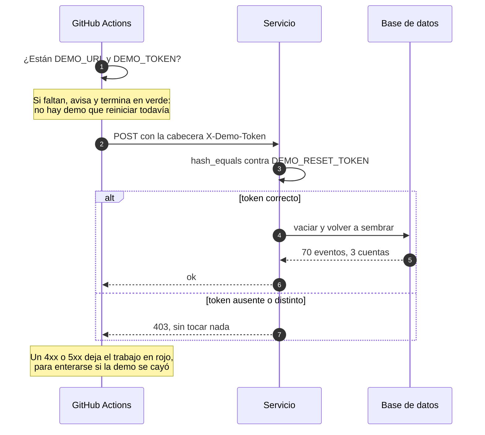
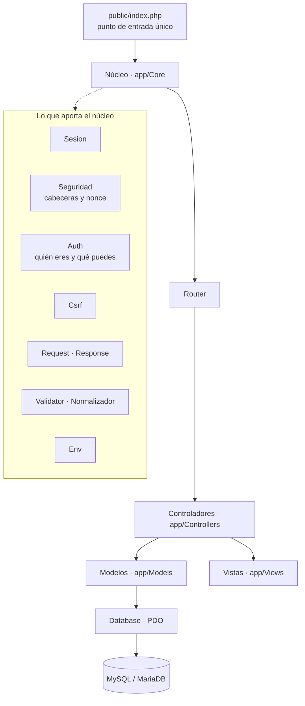
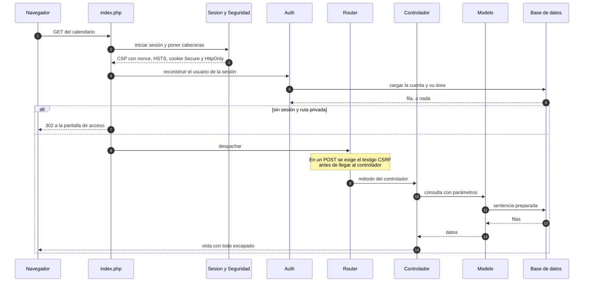
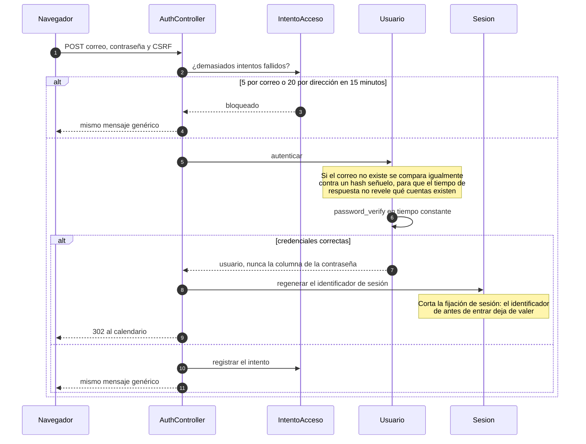
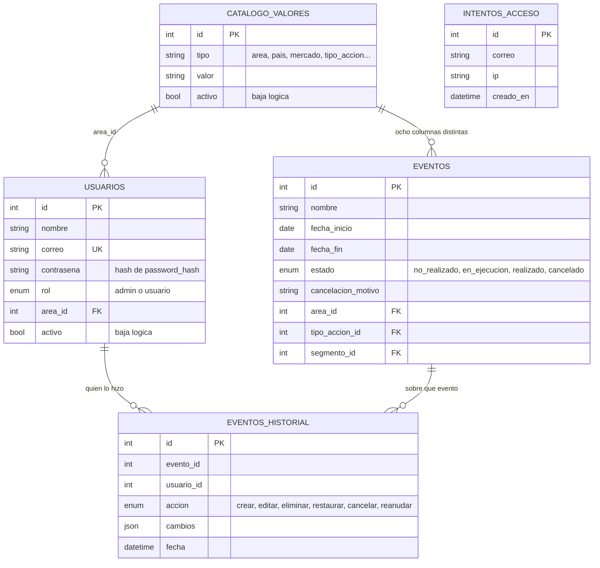
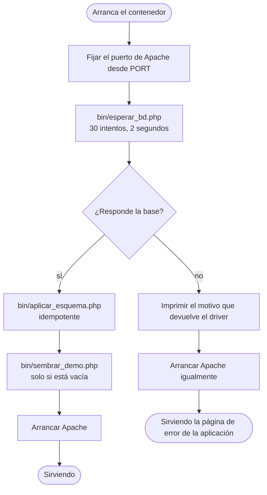

# Arquitectura

Los diagramas están escritos en Mermaid, que GitHub dibuja solo. Se editan como
texto, así que envejecen con el código en lugar de quedarse desfasados en una
imagen que nadie vuelve a exportar.

- [Infraestructura](#infraestructura)
- [Integración y entrega continuas](#integración-y-entrega-continuas)
- [Capas del código](#capas-del-código)
- [Recorrido de una petición](#recorrido-de-una-petición)
- [Cómo se entra](#cómo-se-entra)
- [Modelo de datos](#modelo-de-datos)
- [Arranque del contenedor](#arranque-del-contenedor)

## Infraestructura

Tres piezas: el repositorio, un servicio que corre la imagen y una base
gestionada. Nada más. El contenedor no guarda estado, así que reiniciarlo no
pierde nada y se puede sustituir en caliente.

Detalles que no se ven en el dibujo:

| | |
|---|---|
| La base **solo** habla por red privada | No tiene dirección pública. Únicamente el servicio del mismo proyecto la alcanza |
| La conexión va **cifrada** | El servidor tiene `require_secure_transport=ON` y rechaza de plano cualquier conexión en claro |
| El puerto lo decide la plataforma | Llega en la variable `PORT` y el arranque reconfigura Apache con ella |
| El contenedor no escribe nada que importe | Todo el estado vive en la base. No hay volúmenes |

## Integración y entrega continuas

Cada empujón a `main` y cada propuesta de cambio disparan tres trabajos en
paralelo. Solo cuando el repositorio queda verde, Northflank construye y publica.

### Qué vigila cada trabajo, y por qué existe

Ninguno de los tres está por adorno. Cada uno nació de un fallo que llegó a
producirse.

| Trabajo | Vigila | El fallo real que lo justifica |
|---|---|---|
| **Sintaxis y pruebas** | 71 pruebas contra una base de datos de verdad | La batería pasaba en verde con 35 pruebas **omitidas** en silencio, porque sin base se saltan solas. `--sin-omitidos` convierte omitir en fallo |
| | Modo estricto de SQL | El MariaDB de desarrollo es permisivo y convertía un `NULL` en el valor por defecto. El error solo aparecía al desplegar. Ahora la conexión fuerza `STRICT_TRANS_TABLES` y revienta en la máquina de quien programa |
| | Se siembra **antes** de probar | Hay pruebas que comprueban que los catálogos estén completos. Además así se verifica que el sembrador funciona contra una base limpia |
| **El CSS compilado está al día** | Que no falte ninguna clase propia | `npm run build` regenera la hoja entera. Cualquier regla escrita a mano dentro del compilado desaparecería en la siguiente compilación, sin avisar |
| **La imagen de Docker se construye** | Que el `Dockerfile` siga siendo válido | Un fallo de construcción solo se nota al desplegar, que es el peor momento |

La comprobación del CSS **no compara byte a byte**. Tailwind 4 recorre el
proyecto por su cuenta además de los `@source` declarados, y el resultado
depende del sistema de archivos: Windows y el ejecutor de Linux generan hojas
distintas. Por eso se compara el **conjunto de clases propias**, que es lo que
de verdad importa. Probado en ambos sentidos: detecta la clase que falta y no
salta con un cambio inocuo.

### Reinicio nocturno

La demostración es pública y cualquiera puede crear, editar y borrar. Cada
madrugada vuelve sola a su estado inicial.

Se programa en GitHub y no en el cron de la plataforma a propósito: así funciona
igual aunque la demostración cambie de proveedor.

### Secretos que hacen falta

| Dónde | Nombre | Para qué |
|---|---|---|
| GitHub › Settings › Secrets › Actions | `DEMO_URL` | La dirección de la demo, sin barra final |
| GitHub › Settings › Secrets › Actions | `DEMO_TOKEN` | El mismo valor que `DEMO_RESET_TOKEN` del entorno |
| Plataforma › Variables de entorno | `DEMO_RESET_TOKEN` | Autoriza el reinicio |
| Plataforma › Variables de entorno | `DB_SSL=true` | La base gestionada exige conexión cifrada |

## Capas del código

PHP sin framework, con un autocargador PSR-4 propio. La regla es que cada capa
solo conozca a la de abajo.

Las vistas no consultan la base. Los modelos no escriben HTML. Los controladores
no construyen SQL. Cuando esa separación se rompe se nota enseguida: la prueba
del modelo deja de poder ejecutarse sin levantar media aplicación.

## Recorrido de una petición

## Cómo se entra

El mensaje de error es idéntico en los tres casos a propósito. Decir «ese correo
no existe» le regala a quien prueba una lista de cuentas válidas.

## Modelo de datos

Cinco tablas. La decisión que lo explica entero es la primera: todos los
catálogos viven en **una sola tabla**, distinguidos por su columna `tipo`.

Por qué está así:

- **Un solo catálogo.** Ocho listas distintas (áreas, países, mercados, tipos,
  segmentos, líneas, ciudades, organizadores) con la misma forma: un valor, un
  orden y una baja lógica. Ocho tablas idénticas habrían sido ocho modelos,
  ocho pantallas de administración y ocho migraciones cada vez que cambia algo.
- **Baja lógica en todas partes.** Nada se borra. Un área retirada tiene que
  seguir existiendo para que los eventos antiguos sigan nombrando su área.
- **`eventos_historial` no tiene clave foránea, a propósito.** El registro de
  quién hizo qué debe sobrevivir aunque el evento desaparezca. Una clave foránea
  con borrado en cascada se llevaría por delante justo la prueba que interesaba
  conservar.
- **`cambios` es una columna JSON.** Guarda solo los campos que cambiaron. Es el
  motivo de que haga falta MySQL 8 o MariaDB 10.5 en adelante.

## Arranque del contenedor

Dos decisiones que costó encontrar:

**La espera usa la misma clase `Database` que la aplicación.** Cuando la
comprobación de arranque tiene su propia copia de la lógica de conexión, miente
en cuanto la lógica cambia. Aquí pasó: la base exigía TLS, la comprobación no lo
contemplaba, y el registro solo decía «no respondió».

**Si la base nunca responde, Apache arranca igual.** Un contenedor que muere en
bucle solo produce «conexión rechazada», que no dice nada a nadie. Vivo, la
aplicación muestra su propia página de error y los registros quedan a la vista.
